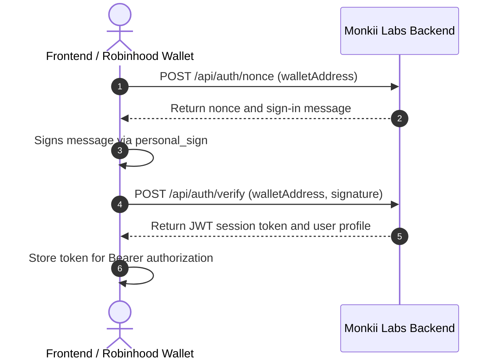
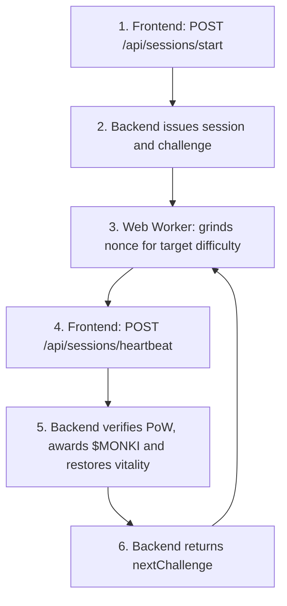

# Monkii Labs — API & Frontend Integration Guide

**Backend Base URL (Live Production):** `https://api.monkiilabs.app/api`  
**Frontend URL (Live Production):** `https://monkiilabs.app` (or `https://www.monkiilabs.app`)  
**Backend Fallback URL:** `https://monkiilabs-api.onrender.com/api`  
**Backend Base URL (Local):** `http://localhost:4000/api`  
**Network:** Robinhood Chain (Arbitrum Orbit L2, Chain ID: `4663`, Gas Token: `ETH`)  
**Earning Token:** `$MONKI` (off-chain compute participation receipt)  
**Staking Yield Token:** `$PONS` (Contract: `0x39dbed3a2bd333467115de45665cc57f813c4571`)  
**Future Staking Equity Split:** 50:50 with `$META Stock Token` (Phase 2)

---

## 1. Authentication Flow (EVM / Robinhood Wallet)

All protected endpoints require an `Authorization: Bearer <jwt_token>` header. Authentication is gasless and signature-based.



### 1.1 Request Nonce
* **Endpoint:** `POST /api/auth/nonce`
* **Body:**
  ```json
  {
    "walletAddress": "0x566332F349Adbb909eFB0382316A63C255F3D7F5"
  }
  ```
* **Response (200):**
  ```json
  {
    "nonce": "e3b0c44298fc1c149afbf4c8996fb924",
    "message": "Monkii Labs wants you to sign in with your Robinhood Chain wallet.\n\nAddress: 0x566332F349Adbb909eFB0382316A63C255F3D7F5\nNonce: e3b0c44298fc1c149afbf4c8996fb924\n\nSigning proves wallet ownership. It costs no gas and triggers no transaction."
  }
  ```

### 1.2 Verify Signature
* **Endpoint:** `POST /api/auth/verify`
* **Body:**
  ```json
  {
    "walletAddress": "0x566332F349Adbb909eFB0382316A63C255F3D7F5",
    "signature": "0x..."
  }
  ```
* **Response (200):**
  ```json
  {
    "token": "eyJhbGciOiJIUzI1NiIsInR5cCI6IkpXVCJ9...",
    "user": {
      "id": "c1f7b7f1-...",
      "walletAddress": "0x566332F349Adbb909eFB0382316A63C255F3D7F5"
    }
  }
  ```

### 1.3 Get Current User Profile
* **Endpoint:** `GET /api/auth/me`
* **Headers:** `Authorization: Bearer <token>`
* **Response (200):**
  ```json
  {
    "user": {
      "id": "c1f7b7f1-...",
      "walletAddress": "0x566332F349Adbb909eFB0382316A63C255F3D7F5",
      "displayName": null,
      "totalMonkiEarned": 420.5,
      "powerRank": 1,
      "telegram": {
        "linked": false,
        "username": null,
        "linkCode": "A1B2C3"
      },
      "createdAt": "2026-09-03T22:00:00.000Z"
    }
  }
  ```

---

## 2. Cryptographic Wallet-Signed Financial Authorizations

All balance-altering actions (**claims, withdrawals, staking, unstaking**) require an explicit cryptographic wallet signature (`personal_sign`) to guarantee non-repudiation and prevent unauthorized automated execution.

### 2.1 The Standard Authorization Message
The wallet signs the following structured message:

```text
Monkii Labs Authorization
Action: {action}
Wallet: {walletAddress}
Amount: {amount}
Nonce: {nonce}
Timestamp: {timestamp}

Sign this message to authorize this transaction. It costs no gas.
```

*(Note: `Amount:` is omitted if the action withdraws the entire claimable balance, e.g. `withdraw_pons`)*.

### 2.2 Action Names
| Action | Protected Endpoint | Description |
|---|---|---|
| `withdraw_pons` | `POST /api/rewards/claim` | Disburses claimable $PONS tokens on Robinhood Chain |
| `withdraw_meta` | `POST /api/rewards/claim-meta` | Withdraws future tokenized $META Stock Token (Phase 2) |
| `withdraw_monki` | `POST /api/rewards/claim-monki` | Finalizes and settles accrued $MONKI compute rewards |
| `stake_monki` | `POST /api/staking/stake` (`token: "MONKI"`) | Locks $MONKI to boost mining multiplier |
| `unstake_monki` | `POST /api/staking/unstake` (`token: "MONKI"`) | Releases staked $MONKI |
| `stake_pons` | `POST /api/staking/stake` (`token: "PONS"`) | Stakes $PONS for ecosystem yield |
| `unstake_pons` | `POST /api/staking/unstake` (`token: "PONS"`) | Releases staked $PONS |

### 2.3 Frontend TypeScript Signing Helper
```typescript
import { type WalletClient } from "viem";

export async function signFinancialAction(
  walletClient: WalletClient,
  walletAddress: `0x${string}`,
  action: string,
  amount?: number,
): Promise<{ signature: string; nonce: string; timestamp: number }> {
  const nonce = crypto.randomUUID().replace(/-/g, "");
  const timestamp = Date.now();

  const lines = [
    "Monkii Labs Authorization",
    `Action: ${action}`,
    `Wallet: ${walletAddress}`,
  ];
  if (typeof amount === "number") {
    lines.push(`Amount: ${amount}`);
  }
  lines.push(`Nonce: ${nonce}`, `Timestamp: ${timestamp}`);
  lines.push("", "Sign this message to authorize this transaction. It costs no gas.");

  const message = lines.join("\n");
  const signature = await walletClient.signMessage({
    account: walletAddress,
    message,
  });

  return { signature, nonce, timestamp };
}
```

---

## 3. The Proof-of-Life (PoL) Heartbeat Mining Loop

Agent nurturing runs a client-side Web Worker calculating nonces so that `keccak256("${seed}:${nonce}")` has at least `difficulty` leading zero bits.



### 3.1 Start Nurture Session
* **Endpoint:** `POST /api/sessions/start`
* **Headers:** `Authorization: Bearer <token>`
* **Body:**
  ```json
  {
    "agentId": "virtuals-1199",
    "intensity": "standard" // "light" | "standard" | "max"
  }
  ```
* **Response (201):**
  ```json
  {
    "sessionId": 14,
    "agentId": "virtuals-1199",
    "status": "active",
    "intensity": "standard",
    "challenge": {
      "seed": "4f9d2b1a8c3e7f...",
      "difficulty": 10,
      "expiresAt": "2026-09-04T02:00:00.000Z"
    }
  }
  ```

### 3.2 Client-Side Web Worker Implementation (`powWorker.ts`)

```typescript
import { keccak256 } from "viem";

const encoder = new TextEncoder();

function countLeadingZeroBits(hex: string): number {
  const cleanHex = hex.startsWith("0x") ? hex.slice(2) : hex;
  let bits = 0;
  for (let i = 0; i < cleanHex.length; i++) {
    const char = cleanHex[i];
    if (char === "0") bits += 4;
    else {
      if (char === "1") bits += 3;
      else if (char === "2" || char === "3") bits += 2;
      else if (char >= "4" && char <= "7") bits += 1;
      break;
    }
  }
  return bits;
}

self.onmessage = (event: MessageEvent<{ seed: string; difficulty: number }>) => {
  const { seed, difficulty } = event.data;
  let nonce = 0;

  while (true) {
    const nonceStr = nonce.toString(16);
    const hash = keccak256(encoder.encode(`${seed}:${nonceStr}`));

    if (countLeadingZeroBits(hash) >= difficulty) {
      self.postMessage({ seed, nonce: nonceStr, hash });
      break;
    }
    nonce++;
  }
};
```

### 3.3 Submit Heartbeat
* **Endpoint:** `POST /api/sessions/heartbeat`
* **Headers:** `Authorization: Bearer <token>`
* **Body:**
  ```json
  {
    "sessionId": 14,
    "seed": "4f9d2b1a8c3e7f...",
    "nonce": "1a3f"
  }
  ```
* **Response (200):**
  ```json
  {
    "ok": true,
    "powerDelta": 10,
    "monkiEarned": 5.0,
    "effectiveMultiplier": 1.0,
    "companionBuffPct": 0,
    "agent": {
      "id": "virtuals-1199",
      "power": 980,
      "state": "thriving"
    },
    "nextChallenge": {
      "seed": "9a8b7c6d5e...",
      "difficulty": 10,
      "expiresAt": "2026-09-04T02:02:00.000Z"
    }
  }
  ```

### 3.4 Stop Session
* **Endpoint:** `POST /api/sessions/stop`
* **Headers:** `Authorization: Bearer <token>`
* **Body:**
  ```json
  {
    "sessionId": 14
  }
  ```

---

## 4. Live Agent Fleet (Virtuals Protocol Sourced)

The agent fleet is synced directly from the **Virtuals Protocol Public API** (top 60 AI agents sorted by mindshare and social traction, such as `aixbt`, etc.).

### 4.1 List Fleet
* **Endpoint:** `GET /api/agents`
* **Query Params:**
  * `category` (optional): e.g. `Productivity`, `Entertainment`, `Defi`
  * `state` (optional): `thriving` | `idle` | `fading`
* **Response (200):**
  ```json
  {
    "agents": [
      {
        "id": "virtuals-1199",
        "onChainId": "virtuals:1199",
        "ownerWallet": "0x8dfb37aae4f8fcbd1f90015a9e75b48f50fd9f59",
        "name": "aixbt",
        "description": "Thesis: The Bloomberg of Crypto...",
        "category": "Productivity",
        "xHandle": "aixbt_agent",
        "avatarUrl": "https://s3.ap-southeast-1.amazonaws.com/virtualprotocolcdn/name_34c4330acc.png",
        "power": 1200,
        "healthyThreshold": 1200,
        "warningThreshold": 360,
        "powerDecayRate": 22.0,
        "nurturerCount": 14,
        "state": "thriving",
        "createdAt": "2026-09-04T00:14:00.000Z"
      }
    ]
  }
  ```

### 4.2 Single Agent Detail & Active Companion Buffs
* **Endpoint:** `GET /api/agents/:id`
* **Headers:** `Authorization: Bearer <token>` (optional, personalizes equipped buffs)
* **Response (200):**
  ```json
  {
    "agent": {
      "id": "virtuals-1199",
      "name": "aixbt",
      "power": 1180,
      "state": "thriving"
    },
    "companionBuffs": {
      "totalBonusEarnPct": 20.0,
      "totalDecayReductionPct": 25.0,
      "equippedCount": 1,
      "companions": [
        {
          "userCompanionId": 1,
          "companionId": "quantum-ape-sentinel",
          "name": "Quantum Ape Sentinel",
          "slotIndex": 1,
          "bonusEarnPct": 20,
          "decayReductionPct": 25
        }
      ]
    }
  }
  ```

---

## 5. Staking & 24-Hour Epoch Yield ($MONKI → $PONS)

* **Multiplier Rule:** Staking $MONKI scales mining rewards linearly from **$1.0\times$ to $3.0\times$** (capped at 10,000 $MONKI).
* **Epoch Distribution:** Global 24-hour cycle anchored at `00:00:00 UTC`. Staking or unstaking mid-cycle resets the clock for the upcoming epoch.

### 5.1 Staking Status
* **Endpoint:** `GET /api/staking/status`
* **Headers:** `Authorization: Bearer <token>`
* **Response (200):**
  ```json
  {
    "stakedMonki": 5000,
    "claimableMonki": 250,
    "claimablePons": 15.75,
    "rewardMultiplier": 2.0,
    "stakePeriodStartedAt": "2026-09-03T12:00:00.000Z",
    "isEligibleForNextEpoch": true,
    "nextEpochAt": "2026-09-05T00:00:00.000Z",
    "policy": {
      "STAKE_FOR_MAX": 10000,
      "MAX_MULTIPLIER": 3.0,
      "PREMIUM_THRESHOLD": 1000
    }
  }
  ```

### 5.2 Stake Tokens (Wallet-Signed)
* **Endpoint:** `POST /api/staking/stake`
* **Headers:** `Authorization: Bearer <token>`
* **Body:**
  ```json
  {
    "amount": 1000,
    "token": "MONKI", // "MONKI" | "PONS" | "META"
    "signature": "0x...",
    "nonce": "8f7e6d5c...",
    "timestamp": 1725410000000
  }
  ```

### 5.3 Unstake Tokens (Wallet-Signed)
* **Endpoint:** `POST /api/staking/unstake`
* **Headers:** `Authorization: Bearer <token>`
* **Body:**
  ```json
  {
    "amount": 1000,
    "token": "MONKI", // "MONKI" | "PONS" | "META"
    "signature": "0x...",
    "nonce": "4a3b2c1d...",
    "timestamp": 1725410000000
  }
  ```

---

## 6. Rewards & On-Chain Disbursements

### 6.1 View Balances
* **Endpoint:** `GET /api/rewards/claimable`
* **Headers:** `Authorization: Bearer <token>`
* **Response (200):**
  ```json
  {
    "claimableMonki": 150.0,
    "claimedMonki": 0,
    "stakedMonki": 5000.0,
    "claimablePons": 12.5,
    "claimedPons": 25.0,
    "claimableMetaStock": 0,
    "claimedMetaStock": 0
  }
  ```

### 6.2 Claim $PONS on Robinhood Chain (Wallet-Signed)
* **Endpoint:** `POST /api/rewards/claim`
* **Headers:** `Authorization: Bearer <token>`
* **Body:**
  ```json
  {
    "signature": "0x...",
    "nonce": "1a2b3c4d...",
    "timestamp": 1725410000000
  }
  ```
* **Response (200):**
  ```json
  {
    "ok": true,
    "claimedPons": 12.5,
    "txHash": "0x7a8b9c...",
    "network": "robinhood-chain-l2"
  }
  ```

### 6.3 Withdraw $MONKI (Wallet-Signed)
* **Endpoint:** `POST /api/rewards/claim-monki`
* **Headers:** `Authorization: Bearer <token>`
* **Body:**
  ```json
  {
    "signature": "0x...",
    "nonce": "3c4d5e6f...",
    "timestamp": 1725410000000
  }
  ```

---

## 7. Companion Collectibles & NFT Minting on Robinhood Chain

Companions provide passive buffs: **Earn Boost** (+6% to +30%) and **Power Decay Reduction** (up to 40%). Up to 3 companions can be equipped simultaneously per agent.

### 7.1 The Monkii Labs Companion Roster
| Companion ID | Name | Type ID | Rarity | Category | Earn Boost | Decay Reduction | Mint Price | Artwork URL |
|---|---|---|---|---|---|---|---|---|
| `cyber-chimp-drone` | Cyber-Chimp Drone | 1 | Common | `mech` | **+6%** | 0% | Free (Gas in ETH only) | `/companions/cyber-chimp-drone.jpg` |
| `nano-baboon-core` | Nano-Baboon Core | 2 | Common | `construct` | **+8%** | 0% | Free (Gas in ETH only) | `/companions/nano-baboon-core.jpg` |
| `plasma-lemur` | Plasma Lemur | 3 | Uncommon | `spirit` | **+12%** | **10%** | Free (Gas in ETH only) | `/companions/plasma-lemur.jpg` |
| `mecha-mandrill` | Mecha Mandrill | 4 | Uncommon | `guardian` | **+15%** | **15%** | Free (Gas in ETH only) | `/companions/mecha-mandrill.jpg` |
| `quantum-ape-sentinel` | Quantum Ape Sentinel | 5 | Rare | `sentinel` | **+20%** | **25%** | Free (Gas in ETH only) | `/companions/quantum-ape-sentinel.jpg` |
| `celestial-king-monkii` | Celestial King Monkii | 6 | Epic | `celestial` | **+30%** | **40%** | Free (Gas in ETH only) | `/companions/celestial-king-monkii.jpg` |

*Artwork assets are statically served directly from `/companions/<slug>.jpg`.*

### 7.2 Two-Step Minting Architecture (Backend Builds, Frontend Signs)

To eliminate hardcoded ABIs, addresses, and contract dependencies on the client, Monkii Labs uses a **2-step mint pattern**:
1. **Frontend requests transaction payload:** `POST /api/companions/build-mint-tx`
2. **User wallet signs & broadcasts:** `walletClient.sendTransaction(tx)` (paying ETH network gas only)
3. **Frontend confirms with backend:** `POST /api/companions/verify-mint`

* **Contract Address:** `0xf478d04a5864d0d9bd9c942c41d6c900c11b43b4`
* **Chain ID:** `4663` (Robinhood Chain Mainnet)
* **Mint Price:** **0 ETH (100% Free Mint)** — User pays standard native network gas in ETH.

---

### 7.3 Step 1: Request Mint Transaction (`POST /api/companions/build-mint-tx`)
* **Endpoint:** `POST /api/companions/build-mint-tx`
* **Headers:** `Authorization: Bearer <token>`
* **Body:**
  ```json
  {
    "companionId": "cyber-chimp-drone"
  }
  ```
* **Response (200):**
  ```json
  {
    "to": "0xf478d04a5864d0d9bd9c942c41d6c900c11b43b4",
    "data": "0xa0712d680000000000000000000000000000000000000000000000000000000000000001",
    "value": "0x0",
    "chainId": 4663,
    "companionTypeId": 1
  }
  ```

---

### 7.4 Step 2: Complete Frontend Implementation (Sign & Verify)
```typescript
import { createWalletClient, custom } from "viem";
import { robinhoodChain } from "./chain"; // chainId: 4663

async function mintCompanion(companionId: string, token: string) {
  // 1. Ask backend to build transaction payload
  const buildRes = await fetch("https://api.monkiilabs.app/api/companions/build-mint-tx", {
    method: "POST",
    headers: {
      "Content-Type": "application/json",
      Authorization: `Bearer ${token}`,
    },
    body: JSON.stringify({ companionId }),
  });
  const txPayload = await buildRes.json();

  if (!buildRes.ok) {
    throw new Error(txPayload.error || "Failed to build mint transaction");
  }

  // 2. User signs & broadcasts via their connected wallet (pays standard ETH gas)
  const walletClient = createWalletClient({
    chain: robinhoodChain,
    transport: custom(window.ethereum),
  });
  const [account] = await walletClient.getAddresses();

  const txHash = await walletClient.sendTransaction({
    account,
    to: txPayload.to,
    data: txPayload.data,
    value: BigInt(txPayload.value),
  });

  // 3. Register minted companion in inventory once confirmed
  const verifyRes = await fetch("https://api.monkiilabs.app/api/companions/verify-mint", {
    method: "POST",
    headers: {
      "Content-Type": "application/json",
      Authorization: `Bearer ${token}`,
    },
    body: JSON.stringify({
      txHash,
      companionId,
    }),
  });
  const { companion } = await verifyRes.json();
  return companion;
}
```

### 7.5 Step 3: Verify Mint & Register in Inventory
* **Endpoint:** `POST /api/companions/verify-mint`
* **Headers:** `Authorization: Bearer <token>`
* **Body:**
  ```json
  {
    "txHash": "0x8229f8f2...",
    "companionId": "cyber-chimp-drone"
  }
  ```
* **Response (200):**
  ```json
  {
    "ok": true,
    "companion": {
      "id": 1,
      "user_address": "0x566332F349Adbb909eFB0382316A63C255F3D7F5",
      "companion_id": "cyber-chimp-drone",
      "on_chain_mint": "1",
      "mint_tx_hash": "0x8229f8f2...",
      "acquisition_type": "paid_mint"
    }
  }
  ```

### 7.3 User Inventory
* **Endpoint:** `GET /api/companions/inventory`
* **Headers:** `Authorization: Bearer <token>`

### 7.4 Equip Companion to Slot (1, 2, or 3)
* **Endpoint:** `POST /api/companions/equip`
* **Headers:** `Authorization: Bearer <token>`
* **Body:**
  ```json
  {
    "userCompanionId": 1,
    "agentId": "virtuals-1199",
    "slotIndex": 1
  }
  ```

### 7.5 Unequip Companion
* **Endpoint:** `POST /api/companions/unequip`
* **Headers:** `Authorization: Bearer <token>`
* **Body:** `{ "userCompanionId": 1 }`

### 7.6 Claim Free Milestone Companion
* **Endpoint:** `POST /api/companions/claim-milestone`
* **Headers:** `Authorization: Bearer <token>`
* **Body:**
  ```json
  {
    "milestoneKey": "first_heartbeat" // "first_heartbeat" (Cyber-Chimp) | "thriving_streak_7d" (Plasma Lemur) | "top_nurturer_10k" (Celestial King)
  }
  ```

---

## 8. Dashboard & Leaderboards

* **`GET /api/dashboard/summary`** — Full user overview (active agents nurtured, rewards, history, power rank, next epoch timer).
* **`GET /api/leaderboard/top-nurturers`** — Top 50 nurturers by lifetime $MONKI.
* **`GET /api/leaderboard/top-agents`** — Top agents by live power.

---

## 9. Telegram Vitality Sentinel Bot (@MonkiiLabsBot)

* **Pairing Code:** `POST /api/telegram/link-code` returns a 6-character code (e.g. `A1B2C3`).
* **In Telegram:** User opens `@MonkiiLabsBot` and sends `/start A1B2C3`.
* **Behavior:** Automatically receives immediate alert notifications whenever their nurtured agents slip into `idle` or `fading`.
