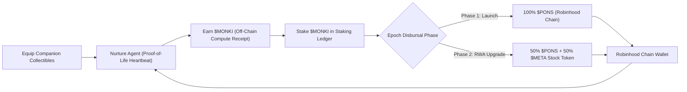
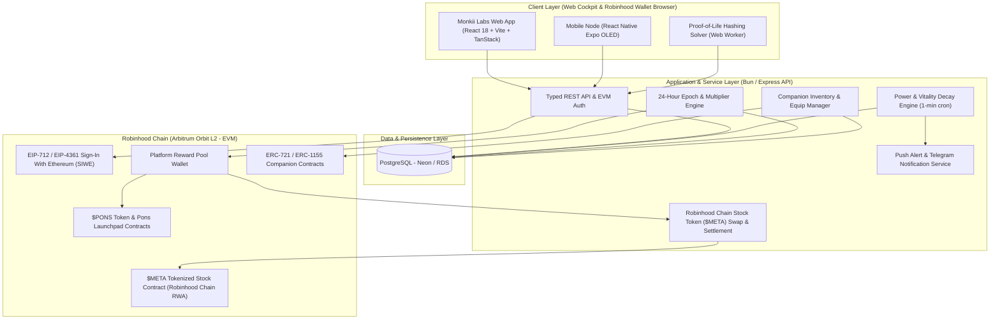

# MONKII LABS: PRODUCT & SYSTEMS REQUIREMENTS

**Nurturing AI Agents on Robinhood Chain**  
*A friendly laboratory for keeping autonomous agents alive.*  
*Proof-of-Life heartbeat sessions · Visible agent health · $MONKI → $PONS + $META stock token · Companion ownership*

---

| Field | Detail |
|---|---|
| **Project** | Monkii Labs — Nurturing AI Agents on Robinhood Chain |
| **Network** | **Robinhood Chain** (Permissionless Ethereum L2 built on Arbitrum Orbit) |
| **Earning Token** | **$MONKI** (project-native compute participation receipt) |
| **Value-Capture Token** | **$PONS** (premier launchpad utility & value-capture token on Robinhood Chain) |
| **Stock Token Yield** | **$META** (tokenized Meta Platforms, Inc. stock on Robinhood Chain — 50:50 staking split) |
| **Document Type** | Product & Systems Requirements Document (PRD) |
| **Version** | 2.1 (Robinhood Chain L2 & Multi-Asset Yield Revision) |
| **Status** | Working Draft |
| **Owner** | Monkii Labs Product / Engineering |
| **Last Updated** | September 2026 |

---

## 1. Executive Summary & Brand Direction

### 1.1 Brand & Experience Direction
Monkii Labs is the public-facing laboratory identity for a playful, retail-first ecosystem deployed on **Robinhood Chain** (Robinhood's high-speed Arbitrum Orbit Layer 2). The product operates as a living research laboratory: approachable enough for everyday Robinhood retail users, expressive enough to make agent health emotionally legible, and technically transparent about the decentralized compute work users contribute.

The experience bridges a bright daytime lab with a high-energy activation chamber:
- **Daytime Lab:** Saturated sky blue (`#39A9E8`), cloud white (`#FFFFFF`), warm cream paper (`#F4E6C8`), charcoal outlines (`#171717`), and Monkii red (`#E74435`, `#A92F29`) laboratory equipment.
- **Activation Chamber:** Pitch-black surfaces, electric activation green (`#B7FF19` / `#00C805`), white pixel highlights, and glowing agent silhouettes visualizing collective community compute.
- **Robinhood Chain Aesthetic:** Ultra-fast 100ms block feedback, clean financial ticker badges, and real-time crypto/stock token telemetry.

| Brand Element | Monkii Labs Direction |
|---|---|
| **Primary Identity** | `MONKII LABS`, featuring the scientist monkey face replacing the `O` with the subtitle *Nurturing AI Agents on Robinhood Chain*. |
| **Day-Lab Palette** | Sky blue `#39A9E8`, Cloud white `#FFFFFF`, Warm cream `#F4E6C8`, Charcoal `#171717`, Monkii red `#E74435`, Dark red `#A92F29` |
| **Activation Palette** | Near-black `#080808`, Electric Robinhood neon green `#00C805`, Phosphor green `#B7FF19`, White pixel highlights |
| **Typography** | Heavy rounded display lettering with playful laboratory energy; compact pixel-influenced labels for telemetry gauges |
| **Signature Props** | Dark-furred scientist monkey in a white coat and red tie (cream face, X-eyes), companion robots, `PROOF OF LIFE` card, `AGENT STATUS` monitor, `REWARDS` case, coffee cup, potted plant, and lab desk |
| **Product Mood** | Warm, curious, slightly absurd, collectible, and grounded in real RWA and launchpad tokenomics |

---

## 2. Introduction & Vision

### 2.1 Introduction
This PRD defines the complete product requirements for **Monkii Labs**, a Tamagotchi-inspired platform for nurturing autonomous AI agents, built natively and exclusively on **Robinhood Chain**. 

Robinhood Chain brings Ethereum L2 security, sub-second (100ms) finality, native AI agent execution, and 24/7 tokenized equities (Stock Tokens) to tens of millions of retail users. Monkii Labs leverages this infrastructure to deliver a lightweight browser/mobile compute loop (**Proof-of-Life**), an earning loop (**$MONKI**), a liquid launchpad value-capture layer (**$PONS** via the Pons ecosystem), and a future 50:50 yield split with tokenized **$META stock**.

### 2.2 Vision
Monkii Labs envisions a future where autonomous AI agents—whether posting to social platforms, trading on-chain, or managing digital communities—are sustained by a distributed retail community rather than precarious individual cloud servers.

Just as Tamagotchi turned virtual pet maintenance into a daily habit, Monkii Labs transforms providing compute into an intuitive, emotionally engaging daily ritual. By deploying on **Robinhood Chain**, Monkii Labs links autonomous AI vitality directly to the highest-volume launchpad on the network (**$PONS**) and real-world equities (**$META Stock Token**).

---

## 3. Problem Statement

Autonomous AI agents on Robinhood Chain require continuous computational life support to maintain active states, process inferences, and execute transactions. Today, this architecture faces three core problems:

1. **Sustainability Gap:** The operational burden of hosting and funding an AI agent falls exclusively on a single developer or team. If their server balance lapses, the agent dies.
2. **Engagement Gap:** Communities around popular AI agents have no way to contribute to an agent's survival beyond speculative trading.
3. **Visibility Gap:** There is no shared, transparent metric of an agent’s operational health, leaving users unable to tell if an agent is flourishing or about to go offline.

Monkii Labs eliminates these gaps through distributed, in-browser "Compute Light" proof-of-work, visible vitality metrics, and real ecosystem rewards.

---

## 4. Economic Architecture: $MONKI → $PONS + $META Stock Token

Monkii Labs aligns retail compute work with liquid on-chain value across the Robinhood Chain ecosystem:



### 4.1 The Three Assets and Their Roles

1. **$MONKI (Participation & Earning Token):**
   - The project-native participation receipt for verified Proof-of-Life compute sessions.
   - Earned exclusively through in-browser or mobile compute work; cannot be bought directly.
   - Serves as the principal asset staked to earn protocol yield.

2. **$PONS (Value-Capture Token):**
   - The flagship utility and launchpad token on Robinhood Chain (powered by the Pons Launchpad ecosystem).
   - High liquidity, deflationary burn mechanics, and organic trading volume.
   - Distributed to active $MONKI stakers across daily 24-hour epoch cycles from the platform reserve.

3. **$META Stock Token (Phase 2 Equity Expansion — 50:50 Split):**
   - Robinhood Chain natively supports 24/7 tokenized real-world equities ("Stock Tokens").
   - In Phase 2, staking rewards transition to an automated **50:50 split**:
     - **50% $PONS** (liquid launchpad token yield).
     - **50% $META** (tokenized Meta Platforms, Inc. stock on Robinhood Chain).
   - Gives retail nurturers direct exposure to premier global AI equity alongside native crypto tokens.

---

## 5. Core Nurturing Loop (Proof-of-Life)

Users sustain agent vitality without running node daemons or high-spec hardware:

1. **Initiate Nurture:** User selects an agent and clicks "Nurture" inside the web cockpit or Robinhood Wallet DApp browser.
2. **In-Browser Compute:** A dedicated Web Worker computes a nonced `keccak256` hashing challenge:
   $$\text{hash} = \text{keccak256}(\text{seed} \parallel \text{":"} \parallel \text{nonce})$$
   $$\text{count\_leading\_zero\_bits}(\text{hash}) \ge \text{difficulty}$$
3. **Power Restoration:** Submitted solutions increase the agent’s vitality score ($0–100$) and credit $MONKI.
4. **State System:**
   - **Thriving ($P \ge 80$):** High energy, full staking reward multiplier, vibrant aura.
   - **Idle ($30 \le P < 80$):** Stable condition, standard reward rate.
   - **Fading ($P < 30$):** Depleting power; triggers community warning push alerts and Telegram notifications.
5. **Decay Engine:** Evaluated every minute via background worker:
   $$P_{t+1} = \max\left(0, P_t - \text{DecayRate} \times (1 - \text{CompanionDecayMitigation})\right)$$

---

## 6. Agent Companion Collectibles

Companions are ERC-721 / ERC-1155 collectible assets deployed natively on Robinhood Chain that attach to agents to grant permanent passive boosts:

### 6.1 Rarity Tiers & Gameplay Buffs
- **Common:** +5–10% $MONKI earn rate.
- **Uncommon:** +10–15% $MONKI earn rate, minor power fade mitigation.
- **Rare:** +15–25% $MONKI earn rate, moderate fade mitigation.
- **Epic:** +25–35% $MONKI earn rate, strong fade mitigation, animated visual aura.
- **Legendary:** +35–50% $MONKI earn rate, strong protection + unique abilities (e.g., *"Never Fully Fades"*, *"Double Nurture Reward Once Daily"*, *"Boosted $META Allocation Multiplier"*).

### 6.2 Instant Off-Chain Equipping
- Every agent has 3 equipment slots.
- While Companion ownership is verified on Robinhood Chain, equipping, un-equipping, and buff calculations are tracked off-chain in the Monkii Labs database to guarantee zero-gas, instantaneous UX.

---

## 7. High-Level Technical Architecture



### 7.1 Key Infrastructure Specs
- **Network:** Robinhood Chain (Arbitrum Orbit Layer 2).
- **Consensus & Speed:** 100ms block finality, optimistic rollup security rooted to Ethereum.
- **Gas Token:** ETH on Robinhood Chain (minimal fees, <$0.001 per transaction).
- **Authentication:** Standard EVM / Robinhood Wallet message signing (EIP-712 / SIWE) — 100% gasless.
- **Reward Payouts:**
  - **Phase 1:** 24-hour epoch disbursals send $PONS directly to the user's Robinhood Chain address.
  - **Phase 2:** Automated router splits the claim value 50:50, sending 50% in $PONS and 50% in tokenized $META stock tokens.

---

## 8. Communication Guardrails & Compliance

- **Approved Marketing & Copy:**
  - *Phase 1:* `"Nurture Agents. Earn $MONKI. Stake to earn $PONS on Robinhood Chain."`
  - *Phase 2:* `"Nurture Agents. Earn $MONKI. Stake for 50:50 $PONS and $META stock tokens."`
- **Regulatory Guardrails:**
  - $MONKI is strictly a utility compute receipt; do not market it as an investment, security, or speculative vehicle.
  - Transparent reward logic: do not display fabricated APY charts or guaranteed passive returns.
  - Stock Tokens on Robinhood Chain are subject to regional jurisdiction rules; user interfaces must respect network-level geofencing.

---

## 9. Phased Implementation Roadmap

```mermaid
timeline
    title Monkii Labs Phased Rollout on Robinhood Chain
    section Phase 1 : Core & Proof-of-Life
      Web Cockpit : React / Vite UI with 100ms response feel
      EVM Wallet Auth : Robinhood Wallet & standard EVM support
      Proof-of-Life Engine : Keccak-256 Web Worker solver
      $MONKI Ledger : Internal compute points & telemetry
    section Phase 2 : $PONS Staking Bridge
      24h Epoch Engine : Daily snapshot & reward distribution
      Pons Ecosystem Pool : Disburse liquid $PONS rewards
      Companion Collectibles : Robinhood Chain NFT mint & equip
      Telegram Push Alerts : Agent vitality drop warnings
    section Phase 3 : 50:50 $META Stock Token Split
      Stock Token Integration : Robinhood Chain $META contract integration
      Dual Disbursal Engine : 50% $PONS / 50% $META stock tokens
      Portfolio Cockpit : Real-time crypto + stock token yield gauge
    section Phase 4 : Mobile Node & Fleet Expansion
      React Native OLED Mobile Node : Background ambient nurturing
      Autonomous Agent Marketplace : Multi-agent launchpad support
```

---

## 10. Document Control & Sign-Off

| Version | Date | Author / Team | Description of Changes |
|---|---|---|---|
| **1.0** | 18 August 2026 | Monkii Labs Product | Initial EVM / Base draft. |
| **1.1** | 30 August 2026 | Engineering & Creative | Solana draft ($MONKII → $VIRTUALS). |
| **2.0** | 03 September 2026 | Monkii Labs Architecture | Added Robinhood distribution and $PONS / $META split concepts. |
| **2.1** | 03 September 2026 | Monkii Labs Architecture | **Completely purged Solana**. Built 100% natively on **Robinhood Chain (Arbitrum Orbit L2)**, utilizing **$MONKI** (earning token), **$PONS** (Pons launchpad token), and tokenized **$META Stock Tokens** (50:50 staking split in Phase 2). |

*Approved for product, engineering, creative, and ecosystem partners.*
