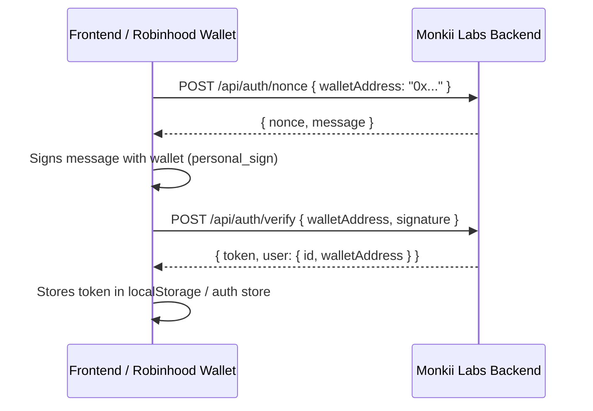
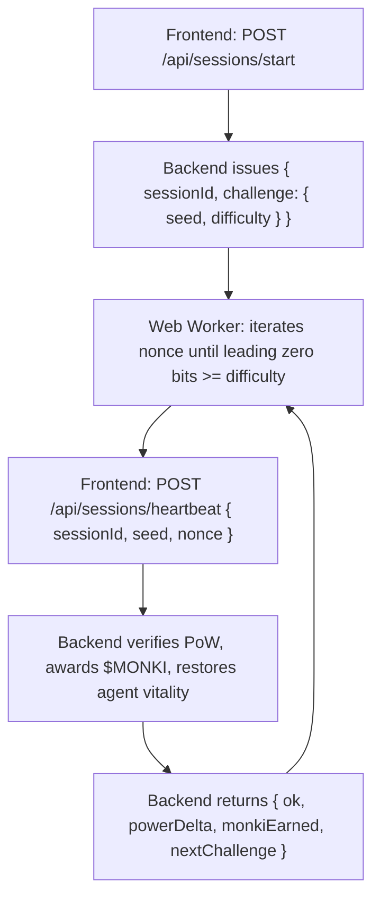

# Monkii Labs — API & Frontend Integration Guide

**Backend Base URL (Live):** `https://monkiilabs-api.onrender.com/api`  
**Backend Base URL (Local):** `http://localhost:4000/api`  
**Network:** Robinhood Chain (Arbitrum Orbit L2, Chain ID: `4663`, Gas: `ETH`)  
**Earning Token:** `$MONKI` (off-chain participation receipt)  
**Staking Yield Token:** `$PONS` (Contract: `0x39dbed3a2bd333467115de45665cc57f813c4571`)  
**Future Staking Equity Split:** 50:50 with `$META Stock Token`

---

## 1. Authentication Flow (EVM / Robinhood Wallet)

All protected endpoints require an `Authorization: Bearer <jwt_token>` header. Authentication is gasless and signature-based.



### 1.1 Request Nonce
* **Endpoint:** `POST /api/auth/nonce`
* **Body:**
  ```json
  {
    "walletAddress": "0x566332F349Adbb909eFB0382316A63C255F3D7F5"
  }
  ```
* **Response (200):**
  ```json
  {
    "nonce": "e3b0c44298fc1c149afbf4c8996fb924",
    "message": "Monkii Labs wants you to sign in with your Robinhood Chain wallet.\n\nAddress: 0x566332F349Adbb909eFB0382316A63C255F3D7F5\nNonce: e3b0c44298fc1c149afbf4c8996fb924\n\nSigning proves wallet ownership. It costs no gas and triggers no transaction."
  }
  ```

### 1.2 Verify Signature
* **Endpoint:** `POST /api/auth/verify`
* **Body:**
  ```json
  {
    "walletAddress": "0x566332F349Adbb909eFB0382316A63C255F3D7F5",
    "signature": "0x..."
  }
  ```
* **Response (200):**
  ```json
  {
    "token": "eyJhbGciOiJIUzI1NiIsInR5cCI6IkpXVCJ9...",
    "user": {
      "id": "c1f7b7f1-...",
      "walletAddress": "0x566332F349Adbb909eFB0382316A63C255F3D7F5"
    }
  }
  ```

### 1.3 Get Current User Profile
* **Endpoint:** `GET /api/auth/me`
* **Headers:** `Authorization: Bearer <token>`
* **Response (200):**
  ```json
  {
    "user": {
      "id": "c1f7b7f1-...",
      "walletAddress": "0x566332F349Adbb909eFB0382316A63C255F3D7F5",
      "displayName": null,
      "totalMonkiEarned": 420.5,
      "powerRank": 1,
      "telegram": {
        "linked": false,
        "username": null,
        "linkCode": "A1B2C3"
      },
      "createdAt": "2026-09-03T22:00:00.000Z"
    }
  }
  ```

---

## 2. The Proof-of-Life (PoL) Heartbeat Mining Loop

Agent nurturing runs a client-side Web Worker calculating nonces so that `keccak256("${seed}:${nonce}")` has at least `difficulty` leading zero bits.



### 2.1 Start Nurture Session
* **Endpoint:** `POST /api/sessions/start`
* **Headers:** `Authorization: Bearer <token>`
* **Body:**
  ```json
  {
    "agentId": "monkii-prime",
    "intensity": "standard" // "light" | "standard" | "max"
  }
  ```
* **Response (201):**
  ```json
  {
    "sessionId": 14,
    "agentId": "monkii-prime",
    "status": "active",
    "intensity": "standard",
    "challenge": {
      "seed": "4f9d2b1a8c3e7f...",
      "difficulty": 10,
      "expiresAt": "2026-09-03T23:59:00.000Z"
    }
  }
  ```

### 2.2 Client-Side Web Worker Implementation (`powWorker.ts`)

```typescript
import { keccak256 } from "viem";

const encoder = new TextEncoder();

function countLeadingZeroBits(hex: string): number {
  const cleanHex = hex.startsWith("0x") ? hex.slice(2) : hex;
  let bits = 0;
  for (let i = 0; i < cleanHex.length; i++) {
    const char = cleanHex[i];
    if (char === "0") bits += 4;
    else {
      if (char === "1") bits += 3;
      else if (char === "2" || char === "3") bits += 2;
      else if (char >= "4" && char <= "7") bits += 1;
      break;
    }
  }
  return bits;
}

self.onmessage = (event: MessageEvent<{ seed: string; difficulty: number }>) => {
  const { seed, difficulty } = event.data;
  let nonce = 0;

  while (true) {
    const nonceStr = nonce.toString(16);
    const hash = keccak256(encoder.encode(`${seed}:${nonceStr}`));

    if (countLeadingZeroBits(hash) >= difficulty) {
      self.postMessage({ seed, nonce: nonceStr, hash });
      break;
    }
    nonce++;
  }
};
```

### 2.3 Submit Heartbeat
* **Endpoint:** `POST /api/sessions/heartbeat`
* **Headers:** `Authorization: Bearer <token>`
* **Body:**
  ```json
  {
    "sessionId": 14,
    "seed": "4f9d2b1a8c3e7f...",
    "nonce": "1a3f"
  }
  ```
* **Response (200):**
  ```json
  {
    "ok": true,
    "powerDelta": 10,
    "monkiEarned": 5.0,
    "effectiveMultiplier": 1.0,
    "companionBuffPct": 0,
    "agent": {
      "id": "monkii-prime",
      "power": 98,
      "state": "thriving"
    },
    "nextChallenge": {
      "seed": "9a8b7c6d5e...",
      "difficulty": 10,
      "expiresAt": "2026-09-04T00:01:00.000Z"
    }
  }
  ```

### 2.4 Stop Session
* **Endpoint:** `POST /api/sessions/stop`
* **Headers:** `Authorization: Bearer <token>`
* **Body:**
  ```json
  {
    "sessionId": 14
  }
  ```

---

## 3. Agent Fleet & Telemetry Endpoints

### 3.1 List Fleet
* **Endpoint:** `GET /api/agents`
* **Query Params:**
  * `category` (optional): e.g. `sentinel`, `defi`, `analytics`
  * `state` (optional): `thriving` | `idle` | `fading`
* **Response (200):**
  ```json
  {
    "agents": [
      {
        "id": "monkii-prime",
        "onChainId": "monkii-prime",
        "name": "Monkii Prime",
        "description": "The flagship autonomous agent maintained by the Monkii Labs retail community on Robinhood Chain.",
        "category": "sentinel",
        "power": 88,
        "healthyThreshold": 80,
        "warningThreshold": 30,
        "powerDecayRate": 1.0,
        "nurturerCount": 12,
        "state": "thriving",
        "createdAt": "2026-09-03T18:00:00.000Z"
      }
    ]
  }
  ```

### 3.2 Single Agent Detail & Active Companion Buffs
* **Endpoint:** `GET /api/agents/:id`
* **Headers:** `Authorization: Bearer <token>` (optional, personalizes equipped buffs)
* **Response (200):**
  ```json
  {
    "agent": {
      "id": "monkii-prime",
      "name": "Monkii Prime",
      "power": 88,
      "state": "thriving"
    },
    "companionBuffs": {
      "totalBonusEarnPct": 20.0,
      "totalDecayReductionPct": 25.0,
      "equippedCount": 1,
      "companions": [
        {
          "userCompanionId": 1,
          "companionId": "void-golem",
          "name": "Void Golem",
          "slotIndex": 1,
          "bonusEarnPct": 20,
          "decayReductionPct": 25
        }
      ]
    }
  }
  ```

---

## 4. Staking & 24h Epoch Yield ($MONKI → $PONS)

* **Multiplier Rule:** Staking $MONKI scales mining rewards linearly from **$1.0\times$ to $3.0\times$** (capped at 10,000 $MONKI).
* **Epoch Distribution:** Runs every 24 hours. Staking or unstaking mid-cycle resets the clock for the upcoming epoch.

### 4.1 Staking Status
* **Endpoint:** `GET /api/staking/status`
* **Headers:** `Authorization: Bearer <token>`
* **Response (200):**
  ```json
  {
    "stakedMonki": 5000,
    "claimableMonki": 250,
    "claimablePons": 15.75,
    "rewardMultiplier": 2.0,
    "stakePeriodStartedAt": "2026-09-03T12:00:00.000Z",
    "isEligibleForNextEpoch": true,
    "nextEpochAt": "2026-09-04T00:00:00.000Z",
    "policy": {
      "STAKE_FOR_MAX": 10000,
      "MAX_MULTIPLIER": 3.0,
      "PREMIUM_THRESHOLD": 1000
    }
  }
  ```

### 4.2 Stake $MONKI
* **Endpoint:** `POST /api/staking/stake`
* **Headers:** `Authorization: Bearer <token>`
* **Body:** `{ "amount": 1000 }`
* **Response (200):**
  ```json
  {
    "stakedMonki": 6000,
    "rewardMultiplier": 2.2,
    "premiumAccess": true
  }
  ```

### 4.3 Unstake $MONKI
* **Endpoint:** `POST /api/staking/unstake`
* **Headers:** `Authorization: Bearer <token>`
* **Body:** `{ "amount": 1000 }`

---

## 5. Rewards & On-Chain $PONS Claims

### 5.1 View Balances
* **Endpoint:** `GET /api/rewards/claimable`
* **Headers:** `Authorization: Bearer <token>`
* **Response (200):**
  ```json
  {
    "claimableMonki": 150.0,
    "claimedMonki": 0,
    "stakedMonki": 5000.0,
    "claimablePons": 12.5,
    "claimedPons": 25.0,
    "claimableMetaStock": 0,
    "claimedMetaStock": 0
  }
  ```

### 5.2 Claim $PONS on Robinhood Chain
* **Endpoint:** `POST /api/rewards/claim`
* **Headers:** `Authorization: Bearer <token>`
* **Response (200):**
  ```json
  {
    "ok": true,
    "claimedPons": 12.5,
    "txHash": "0x7a8b9c...",
    "network": "robinhood-chain-l2"
  }
  ```

---

## 6. Companion Collectibles (3 Equipment Slots)

### 6.1 Catalog
* **Endpoint:** `GET /api/companions/catalog`
* **Response (200):** Lists all 6 archetypes: `spark-orb`, `circuit-beetle`, `solar-sprite`, `byte-fox`, `void-golem`, `quantum-phoenix`.

### 6.2 User Inventory
* **Endpoint:** `GET /api/companions/inventory`
* **Headers:** `Authorization: Bearer <token>`

### 6.3 Equip to Slot (1, 2, or 3)
* **Endpoint:** `POST /api/companions/equip`
* **Headers:** `Authorization: Bearer <token>`
* **Body:**
  ```json
  {
    "userCompanionId": 1,
    "agentId": "monkii-prime",
    "slotIndex": 1
  }
  ```

### 6.4 Unequip
* **Endpoint:** `POST /api/companions/unequip`
* **Headers:** `Authorization: Bearer <token>`
* **Body:** `{ "userCompanionId": 1 }`

### 6.5 Claim Free Milestone Companion
* **Endpoint:** `POST /api/companions/claim-milestone`
* **Headers:** `Authorization: Bearer <token>`
* **Body:**
  ```json
  {
    "milestoneKey": "first_heartbeat" // "first_heartbeat" | "thriving_streak_7d" | "top_nurturer_10k"
  }
  ```

---

## 7. Dashboard & Leaderboards

* **`GET /api/dashboard/summary`** — Full user overview (active agents nurtured, rewards, history, power rank, next epoch timer).
* **`GET /api/leaderboard/top-nurturers`** — Top 50 nurturers by lifetime $MONKI.
* **`GET /api/leaderboard/top-agents`** — Top agents by live power.

---

## 8. Telegram Vitality Bot (@MonkiiLabsBot)

* **Pairing Code:** `POST /api/telegram/link-code` returns a 6-character code (e.g. `A1B2C3`).
* **In Telegram:** User opens `@MonkiiLabsBot` and sends `/start A1B2C3`.
* **Behavior:** Automatically receives immediate alert notifications whenever their nurtured agents slip into `idle` or `fading`.
